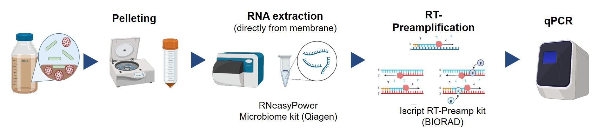
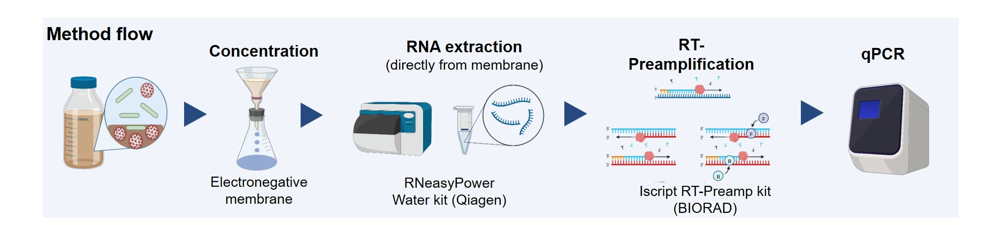
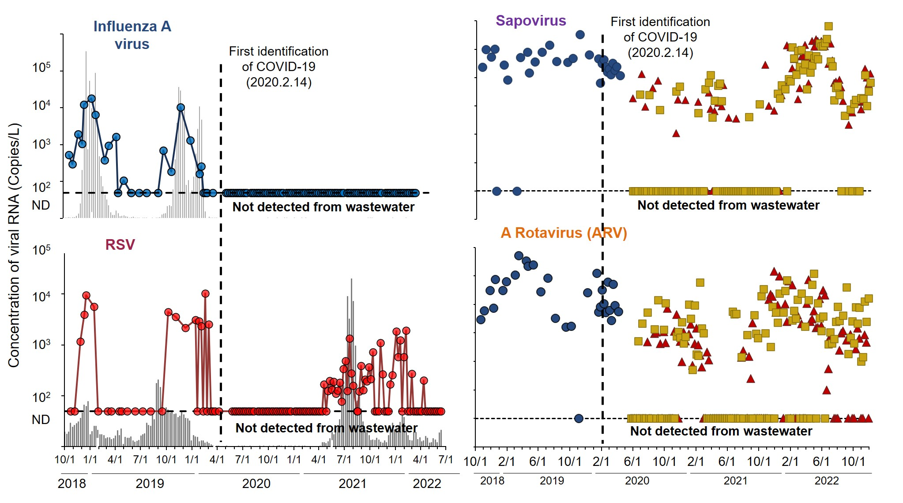
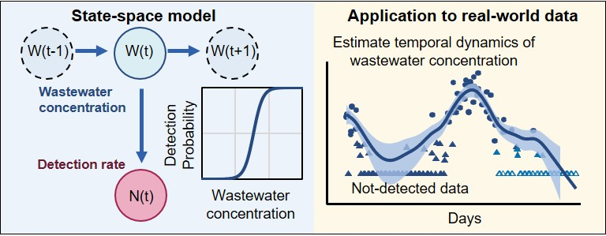
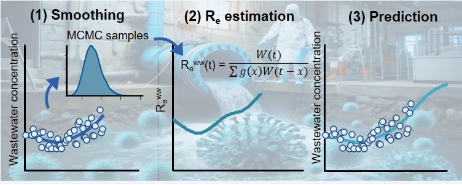

I have focused on two major areas of wastewater surveillance ([Google Scholar](https://scholar.google.com/citations?user=2ucfkxcAAAAJ&hl=ja)):
- Development of highly sensitive detection methods for infectious disease viruses in wastewater
- Development of an analytical framework for wastewater surveillance data

# Master reseach 2020-20222
---
### 1. EPISENS-S method

A major challenge in the real-world application of wastewater surveillance is the limited sensitivity of existing methods for detecting pathogens in wastewater. To overcome this, we developed a highly sensitive detection method called the "EPISENS-S method" ([Paper](https://www.sciencedirect.com/science/article/pii/S0048969722041985)). This method is
- approximately 100 times more senstive than a conventional method
- a simple method without additonal investiment for equipment
The simplicity is crucial for social implementation of wastewater surveillance.

### 2. EPISENS-M method

The detection performance of the EPISENS-S method is influenced by the amount of solids, as it relies on pelleting during the wastewater concentration step. Moreover, its application is limited to viruses present in the solid fraction and water samples with a sufficient solid content. To address this limitation, we developed the EPISENS-M method, which replaces pelleting with electronegative membrane filtration followed by direct RNA extraction ([Paper](https://www.sciencedirect.com/science/article/pii/S0160412023000168)). This method
- is approximately 100 times more senstive than a conventional method
- capture viruses in both solid and liquid fractions of wastewater
- is applicable to raw wastewater, treated wastewater, and environmental water 
- is applicable to envelope and non-envelope viruses

### 3. Detection of respiratory and gastroenteritics viruses

Using the EPISENS-M method, we conducted approximately four years of wastewater surveillance for respiratory and gastroenteritis viruses in Sapporo City, Japan ([Paper](https://www.sciencedirect.com/science/article/pii/S0048969723013104), [Paper](https://www.sciencedirect.com/science/article/pii/S0048969723051823)). We 
- demonstrated the applicability of wastewater surveillance for Influenza A virus and Respiratory syncytial virus
- highlighted the applicability for Norovirus, Rotavirus, Sapovirus, and Aichivirus
- revealed epidemic dynamics of the infectious viruses before and during COVID-19
- Lead to the implementation of wastewater surveillance in Sapporo city, Japan ([Link](https://www.city.sapporo.jp.e.ain.hp.transer.com/gesui/surveillance.html)).

# Ph.D reseach 2023-Present
---
### 1. Handling left-censored wastewater suveillance data
  
Despite technological advancements, non-detected samples are still observed. Left-censored data hinders an accurate understanding of the temporal dynamics of wastewater concentration. To address this, we developed a state-space model to handle left-censored wastewater surveillance data ([Paper](https://www.sciencedirect.com/science/article/pii/S0043135426001703)). The developed model
- uses only wastewater concentration and detection rate data
- enables to estimate wastewater concentration in lull period when negative samples are often observed
- smoothe wastewater concentration data to clearly show temporal dynamics

### 2. Coming soon (2025)

### 3. Wastewater-based effective reproduction number and prediction
  
Estimating the effective reproduction number and predicting incidence using wastewater surveillance data have been conducted by incorporating the shedding dynamics of infected individuals into infectious disease models. However, shedding dynamics for most infectious diseases remain unknown. To address this, we developed a model to approximate the effective reproduction number and predict wastewater concentration up to several weeks in advance using only wastewater concentration data ([Paper](https://www.sciencedirect.com/science/article/pii/S0160412024007141)).

