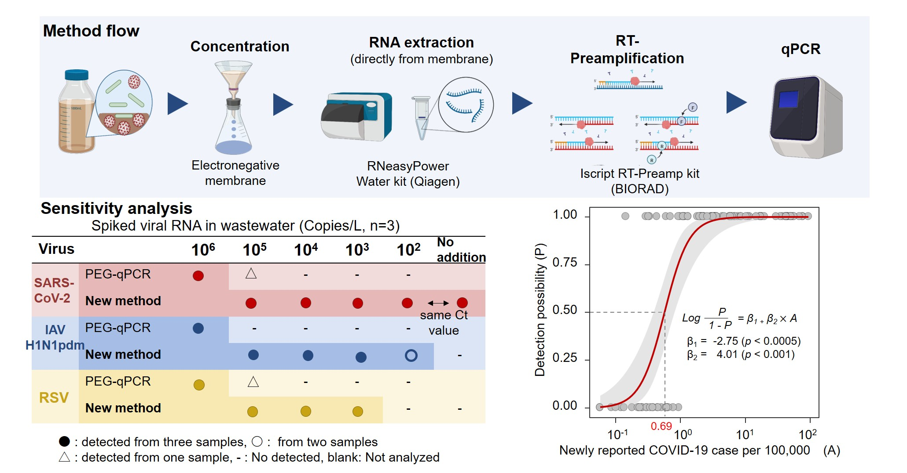

# Development of highly sensitive detection methods 
### 1. EPISENS-S method (2022)

- Detect viruses in solid fractions of wastewater
- Simple method without additonal investiment for equipment
- Approximately 100 times senstive than a conventional method
- Pelleting is a critical step for the viral detection
- Affected by the amount of solids

### 2. EPISENS-M method (2023)

- Approximately 100 times senstive than a conventional method
- Capture viruses in both solid and liquid fractions of wastewater
- Applicable to raw wastewater, treated wastewater, and environmental water 
- Applicable to envelope and non-envelope viruses

### 3. Detection of respiratory and gastroenteritics viruses (2023-2024)

- Use the EPISENS-M method
- Influenza A virus and Respiratory syncytial virus
- Norovirus, Rotavirus, Sapovirus, and Aichivirus
- First study for long-term wastewater surveillance in Japan
- Reveal epidemic dynamics of the infectious viruses before and during COVID-19
- Lead to social implementation of wastewater surveillance in Sapporo city, Japan

#  Mathematical modeling 
Coming soon 
