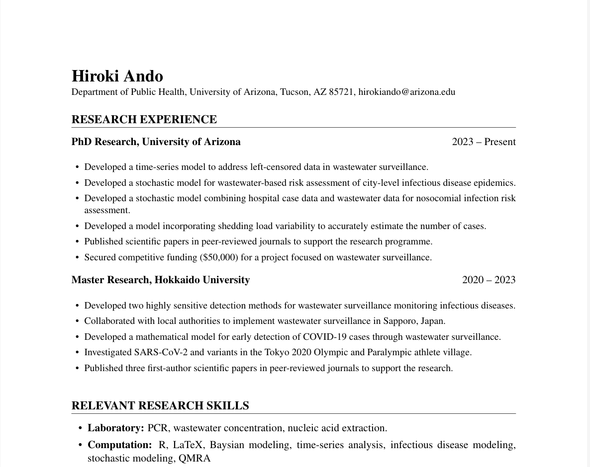

---
# You don't need to edit this file, it's empty on purpose.
# Edit theme's home layout instead if you wanna make some changes
# See: https://jekyllrb.com/docs/themes/#overriding-theme-defaults
layout: single
author_profile: true
title: Ph.D. Student in Public Health
---

I am a Ph.D. student with research interests in infectious disease epidemiology and [wastewater-based epidemiology](https://www.youtube.com/watch?v=G4PN7rXHEWY), which is one type of environemtnal surveillance that uses sewage to monitor the presence and dynamics of biological or chemical markers in a community.
I completed my Master’s training in environmental engineering, where I developed a strong foundation in water systems and environmental processes, and during my doctoral studies I have expanded my focus to public health. My current research centers on 
- the design of effective wastewater sampling strategies including development of highly sensitive detection methods 
- the development of statistical modeling frameworks to analyze wastewater-based data so that it can meaningfully inform public health decision-making.

Ultimately, my goal is to contribute to building a society that is more resilient to infectious disease threats by integrating environmental monitoring with rigorous statistical analysis and public health practice.

Wastewater and environmental water surveillance for infectious diseases: <u><b>an interdisciplinary discipline between environmental engineering and public health.</b></u>

## Contact
Email: [hirokiando@arizona.edu] or [hirokiando.res@gmail.com]  
